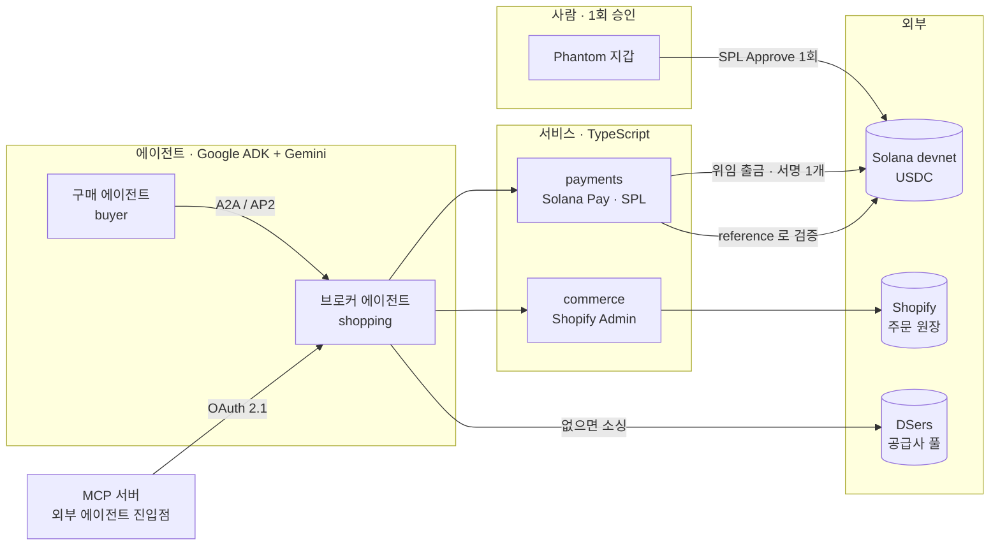

# Relay

**에이전트 네이티브 리셀 브로커 — 사람이 클릭하지 않는 커머스**

Google Cloud × Solana AI Agentic Hackathon · Track C: Multi-Agent Commerce

---

## 1. 한 문장

**서로 신뢰하지 않는 두 AI 에이전트가, 은행 계좌도 카드도 사람의 클릭도 없이, 즉시 그리고 검증 가능하게 정산한다.**

구매 에이전트가 "3만 원 이하 무선 이어폰"을 위임받으면, 브로커 에이전트가 실제 공급사에서 상품을 소싱하고 가격을 매겨 **에이전트 네이티브 결제 요청**을 발행한다. 구매자의 지갑이 **자율 서명**하고, 브로커는 그 결제를 **온체인에서 직접 검증**한 뒤 주문을 기록한다.

---

## 2. 왜 지금 이 문제인가

AI 에이전트는 이미 검색하고, 비교하고, 추천한다. **그런데 마지막 한 걸음에서 반드시 사람에게 돌아온다.**

| 기존 결제 수단 | 에이전트가 못 쓰는 이유 |
|---|---|
| 신용카드 | 에이전트 명의 카드가 없다. 사람 카드를 쥐여주면 한도 통제가 불가능하다 |
| 은행 이체 | 계좌 개설에 법인·신원이 필요하고, 정산이 느리다 |
| 웹 체크아웃 | **사람이 버튼을 누르는 것이 전제**다. 그 순간 자율성이 사라진다 |

에이전트 경제의 병목은 지능이 아니라 **정산 레일**이다.

---

## 3. 타깃

### 기업 — 헤드리스 커머스 사업자
Shopify·자체 몰을 운영하며 **AI 에이전트 트래픽을 매출로 전환**하고 싶은 곳. 사람용 체크아웃을 유지한 채, 에이전트에게는 별도의 결제 레일을 열어준다.

### 기관 — 에이전트 플랫폼·마켓플레이스
자사 에이전트에 **구매 능력**을 주고 싶지만 카드 위임의 리스크를 감당할 수 없는 곳. 온체인 지출 한도로 위임 범위를 강제한다.

### 개인 — 에이전트를 쓰는 소비자
반복 구매·비교 구매를 에이전트에 맡기고 싶은 사람. **한 번 승인하고, 그 뒤로는 클릭하지 않는다.**

---

## 4. 해결 방식 — 세 가지 결정

### ① 결제 주체는 사람의 지갑, 실행은 에이전트
SPL Token 위임(delegate)으로 **한 번만** 승인한다. 이후 브로커가 그 한도 안에서 사용자 지갑에서 직접 출금한다.

- 한도 초과는 **체인이 거부한다.** 우리 코드가 아니라 프로토콜이 강제한다
- 사용자는 언제든 `Revoke` 할 수 있다
- 가스는 브로커가 대납하므로 **사용자 지갑에 SOL이 0이어도 된다**

### ② 검증은 온체인, 신뢰는 필요 없다
결제 요청마다 고유한 `reference` 공개키를 트랜잭션에 태그한다. 브로커는 구매자의 "냈다"는 주장을 믿지 않고 **체인에서 직접 조회해 확인한다.**

### ③ 카탈로그는 에이전트가 채운다
찾는 상품이 없으면 **"안 팝니다"로 끝내지 않는다.** 브로커가 공급사 풀(DSers/AliExpress)을 검색해 임포트하고 스토어에 올린 뒤 판매한다.

---

## 5. 아키텍처



**Google Cloud**: 5개 서비스가 Cloud Run에서 scale-to-zero로 운영된다. Secret Manager가 지갑·OAuth 토큰을 보관하고, 회전되는 refresh token을 원자적으로 승격한다.

**프로토콜**: A2A(Agent2Agent) AgentCard + JSON-RPC, AP2(Agent Payments Protocol) 만데이트 체인, Solana Pay transfer-request, MCP(Model Context Protocol) 원격 서버.

---

## 6. 도입 시나리오

### 시나리오 A — 스토어프론트 (사람이 있는 경우)
```
① 지갑 로그인            Shopify 고객계정 ← Clerk OIDC ← Sign in with Solana
② 한도 승인 1회           "브로커에게 최대 50 USDC" · 온체인 위임
③ 대화로 요청             "3달러 이하 무선 이어폰"
④ 에이전트가 소싱·비교      카탈로그에 없으면 공급사에서 구해온다
⑤ 결제                   ← 여기서부터 클릭 0회
⑥ 검증 · 주문 기록         온체인 확인 후 Shopify에 paid 주문
```

### 시나리오 B — 외부 에이전트 (사람이 없는 경우)
Claude 등 임의의 MCP 클라이언트가 OAuth 2.1(PKCE + 동적 클라이언트 등록)로 인증하고, 7개 도구로 검색·견적·결제·검증·환불을 수행한다. **API 키를 발급하지 않는다** — 모든 구매가 실제 신원과 검증된 지갑에 귀속된다.

### 시나리오 C — B2B 조달 (확장)
반복 구매를 에이전트에 위임하고, 지출 한도를 온체인으로 강제한다. 감사(audit)는 체인이 대신한다.

---

## 7. 수익 모델

**아비트리지 마진** — 공급가와 판매가의 스프레드.

| 항목 | 실측값 |
|---|---|
| 공급사 원가 (AliExpress) | $2.47 |
| Shopify 등록가 | $2.84 |
| 브로커 판매가 | 3.27 USDC |
| **마진** | **0.80 (32%)** |

마크업률은 `BROKER_MARKUP_PCT`로 조정된다. 원가는 공급사에서 실제로 조회한 값을 상품별로 기록하며(SKU가 상품 간 충돌하므로 Shopify GID로 키를 잡는다), 마진은 서버 로그와 주문 레코드에만 남고 **구매자에게 노출되지 않는다.**

확장 수익원: 에이전트 트래픽 중개 수수료, 헤드리스 머천트 연동 라이선스.

---

## 8. 실증 (2026-08-03 기준)

| 항목 | 수치 |
|---|---|
| Shopify 주문 | **39건** (PAID 33건, 누적 $96.29) |
| ACTIVE 상품 | 30개 — 이 중 **24개는 에이전트가 스스로 소싱** |
| Cloud Run 서비스 | 5개 (us-central1, scale-to-zero) |
| 자동화 테스트 | Python 109 + TypeScript 41 |
| 머지된 PR | 28건 |

온체인 증거는 모두 devnet explorer에서 조회 가능하다. 대표 사례:
- **사용자 지갑 자율 결제** — 승인 1회 후 서명 1개로 2.21 USDC 출금, 잔여 한도 자동 차감
- **한도 초과** — 체인이 거부
- **Revoke 후** — 결제 거부
- **자율 소싱** — 요청 4분 전에 존재하지 않던 상품을 구해와 결제까지 완료

---

## 9. 정직하게 밝히는 경계

심사자가 물을 것을 먼저 적는다.

- **네트워크는 devnet이다.** USDC는 테스트 화폐다. 다만 SPL 위임·Solana Pay reference 태깅·온체인 검증은 실제 프로토콜 경로이며, 메인넷 전환은 RPC와 mint 설정 변경이지 재작성이 아니다.
- **공급사 발주(Leg 2)는 연결돼 있으나 자금이 투입되지 않았다.** 구조화 배송지가 Shopify 주문에 실리면 기존 드롭쉬핑 연동이 발주하지만, 테스트넷 수익으로 실제 공급사에 지불하는 것이 무의미하여 플래그(`SUPPLIER_FULFILLMENT_ENABLED`)를 꺼두었다. 배송 상태는 지어내지 않고 `not_connected`로 표시한다.
- **가짜 데이터를 만들지 않는다.** 하드코딩된 운송장 번호를 반환하던 경로는 제거했고, 공급사 주문 상태는 실제 신호가 있을 때만 진행 상태를 주장한다.

---

## 10. 왜 온체인이어야 하는가

카드로도 되지 않느냐는 질문에 대한 답.

1. **에이전트에게는 명의가 없다.** 카드·계좌는 법인 또는 자연인을 전제한다. 지갑은 키만 있으면 된다.
2. **위임 범위를 프로토콜이 강제한다.** 카드를 맡기면 한도를 앱이 지켜야 한다. SPL 위임은 체인이 지킨다.
3. **검증에 상대방의 협조가 필요 없다.** 브로커는 구매자에게 영수증을 요구하지 않는다. `reference`로 직접 조회한다.
4. **정산이 즉시다.** 카드 정산은 며칠, 국경을 넘으면 더 걸린다.

에이전트가 늘어날수록 **서로 모르는 주체 간의 소액·고빈도 정산**이 문제가 된다. 그것이 온체인이 실제로 더 나은 지점이다.

---

## 11. 링크

- **GitHub** — https://github.com/hoddukzoa12/relay
- **스토어프론트** — https://solanagcp.myshopify.com (개발 스토어, 비밀번호는 제출물에 별도 기재)
- **MCP 문서** — https://solanagcp.myshopify.com/pages/mcp
- **MCP 엔드포인트** — https://mcp-763kssfe2q-uc.a.run.app/mcp
